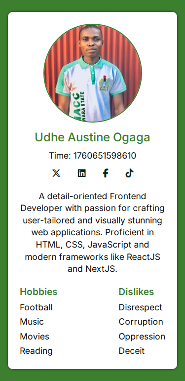
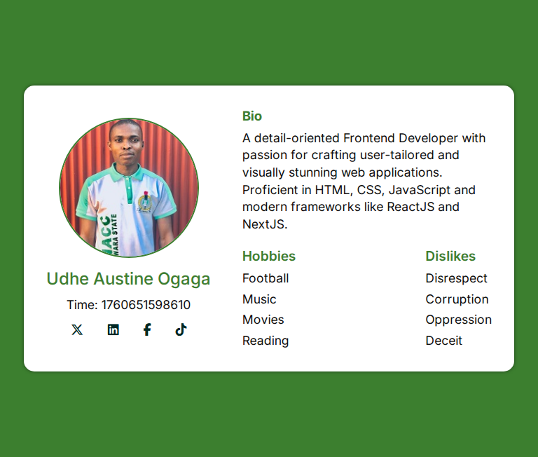
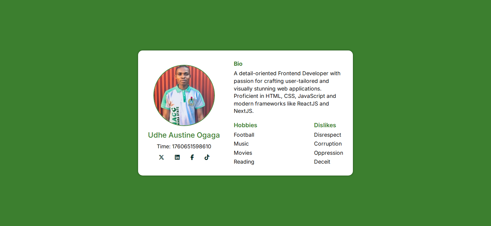

# HNG Internship 13 Stage 0 Task: Build a Testable Profile Card Solution

## Table of contents

- [Overview](#overview)
  - [Task instructions](#task-instructions)
  - [Screenshot](#screenshot)
  - [Links](#links)
- [My process](#my-process)
  - [Built with](#built-with)
  - [Features](#features)
- [Installation & Usage](#features)
- [Author](#author)


## Overview

This project displays a user profile card component that includes:
- A user avatar  
- Name and short bio  
- Hobbies and dislikes  
- Social media links (X/Twitter, Facebook, LinkedIn, TikTok)  
- A dynamically displayed timestamp (in milliseconds)  

It’s designed with a **mobile-first approach** to ensure smooth performance and clean layout on all screen sizes.

### Task instructions
 In this task, you’ll build a small, accessible, responsive Profile Card component/page using semantic HTML and modern frontend patterns using plain HTML/CSS/vanilla JS. Every visible element must include a data-testid attribute so automated tests can target it.


Acceptance criteria (checklist for grading / automated tests)
 All required elements exist and are discoverable by the given data-testids.
 HTML uses semantic tags (article, figure, nav, section, headings).
 The test-user-time value equals Date.now() (or a value within a reasonable delta if rendering delay exists) and is shown in milliseconds.
 Avatar renders with an alt attribute and data-testid="test-user-avatar".
 Social links present inside test-user-social-links and optionally individually testable (e.g., test-user-social-twitter).
 Hobbies and dislikes are distinct lists with their respective data-testids.
 Keyboard navigation works for links; focus styles are visible.
 Layout is responsive at typical breakpoints (mobile/tablet/desktop).


## My process

### 🛠️ Built with

- **HTML5** – Semantic structure and layout  
- **CSS3** – Responsive styling and animations  
- **JavaScript (ES6+)** – Dynamic DOM manipulation and interactivity  
- **Font Awesome** – Social media and UI icons  
- **Google Fonts** – Modern, elegant typography
- **Git and Github** - Version control
- Accessibility


### 🎨 Features

✅ Mobile-first responsive layout  
✅ Clean card design with soft shadows and rounded edges  
✅ Dynamic timestamp rendering using JavaScript  
✅ Social icons using Font Awesome CDN  
✅ Custom typography via Google Fonts  
✅ Hover effects and smooth transitions  

---

## 📦 Installation & Usage

1. **Clone or download** this repository:
   ```bash
   git clone https://github.com/Austinet/hngi-profile-card.git
Open index.html in your browser.


### Screenshot





### Links

- Solution URL: [Github Repo](https://github.com/Austinet/hngi-profile-card.git)
- Live Site URL: [Github Pages](https://Austinet.github.io/hngi-profile-card)


## 💬 Author

- Portfolio 🌐 - [Udhe Austine Ogaga](https://austinet-portfolio.netlify.app)
- X/Twitter - [@udhe.austine](https://www.x.com/austineudhe)
- Linkedin - [Udhe Austine Ogaga](https://www.linkedin.com/in/udhe-austine-ogaga)
